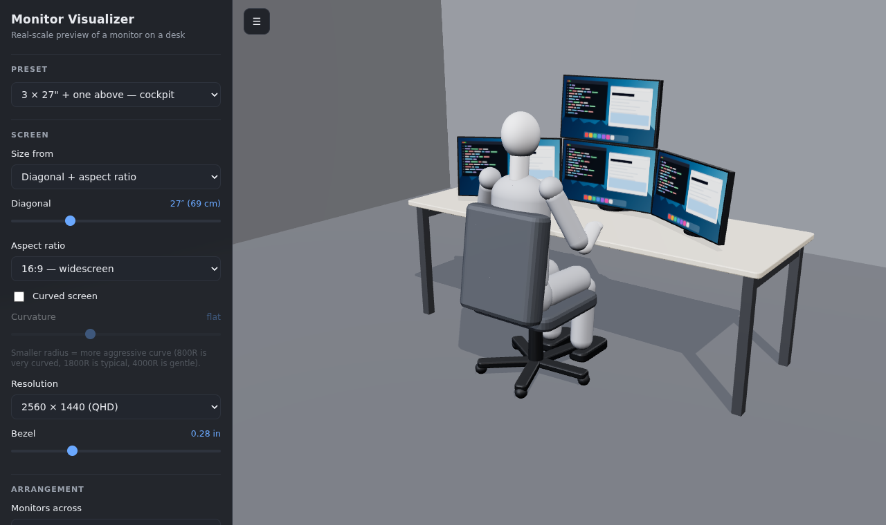
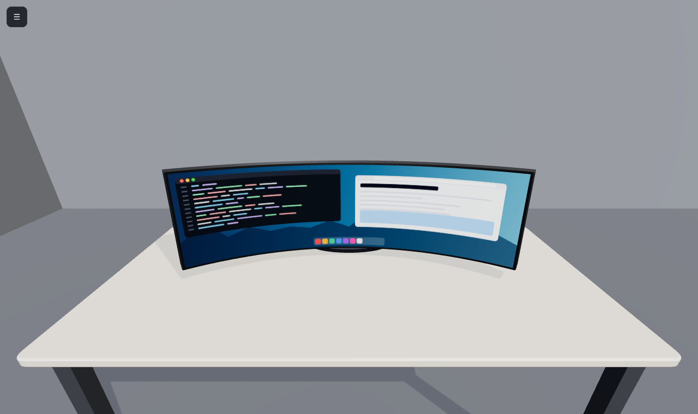

# Monitor Visualizer

A small website for answering the question *"how big is that monitor, really?"*

Type in a monitor's diagonal, aspect ratio and curvature and it appears at true scale
in a 3D scene: a plain desk, a blank seated figure for reference, and the screen itself.
Orbit around it, or drop into the seat and see what the panel actually covers from there.



From the seat, with a 49″ 32:9 at 1000R — rendered at a 114° horizontal field of
view, so the panel covers the same share of the frame as it would of your vision:



## Running it

The site lives in `public/`. Everything in it is static — HTML, CSS and ES modules,
with three.js vendored alongside. There is no build step and no network access at
runtime, but ES modules need to be served over HTTP (opening `index.html` from the
filesystem will not work):

```bash
python3 -m http.server 8000 -d public
# then open http://localhost:8000
```

## Deploying

Any static host works. Serve `public/` as the site root — the repository root holds
the README screenshots and licence, which do not belong on the CDN.

On **Cloudflare Pages**: framework preset *None*, build command empty, build output
directory `public`. `public/_headers` then applies the caching policy: the versioned
`vendor/three-0.160.1/` path is immutable for a year, while the app's own files
revalidate on every load so a deploy never leaves stale code in a browser cache.

## What you can change

| Control | Notes |
| --- | --- |
| Diagonal | 13″–65″, the usual flat-panel measurement |
| Aspect ratio | 4:3 through 32:9 |
| Curvature | flat, or a radius from 500R (extreme) to 4000R (gentle) |
| Resolution | drives the pixel-density readout |
| Bezel | 0–25 mm border around the active area (the panel itself is modelled 1″ thick) |
| Placement | height above the desk, tilt, desk height and depth |
| Person | standing height 140–210 cm, eye-to-screen distance |
| View | orbit, eye level, front, side, top |
| Guides | draws the field-of-view cone and the screen's arc |

Presets cover the common sizes (24″ 16:9 through 57″ 32:9). Settings live in the URL
hash, so **Copy shareable link** produces a link that restores the exact setup.

## The numbers it reports

* **Panel size** — a diagonal *d* at aspect *w:h* gives width `d·w/√(w²+h²)` and
  height `d·h/√(w²+h²)`. A curved panel is quoted the same way, flattened, so that
  width is also the arc length of the curve.
* **Curve depth (sagitta)** — for radius *R* the panel wraps through `θ = width/R`
  radians and its edges sit `R(1 − cos(θ/2))` closer to you than its centre.
* **Field of view** — the angle the panel subtends from the seated eye position,
  measured to the real edge positions, so the curve's forward wrap is included.
  It is also reported as a share of the ~114° both eyes take in at once, which is
  the field the eye-level view renders: the camera stays at the eye, so a panel
  that overflows the frame is one that genuinely overflows your vision.
* **Pixel density** — pixels per inch across the flat diagonal, plus the dot pitch.
* **Eye vs. screen top** — how far the seated eye line falls above or below the top
  edge, the number that usually decides whether a monitor is mounted too low.

Seated proportions come from the usual anthropometric fractions of standing height
(seat height ≈ 0.25·H, seated eye height ≈ 0.455·H above the seat), so the figure's
eye line moves sensibly with the height slider.

## Layout

```
public/                     everything that gets deployed
  index.html                markup, control panel, import map
  styles.css                UI styling
  _headers                  Cloudflare Pages caching and security headers
  src/config.js             state, presets, screen maths, URL encoding
  src/main.js               scene assembly, layout, camera views, render loop
  src/monitor.js            chassis / bezel / screen geometry and the stand
  src/person.js             seated mannequin and chair
  src/room.js               floor, walls and desk
  src/guides.js             field-of-view overlay lines
  src/screenTexture.js      procedurally drawn screen contents
  src/geometry.js           rounded-box helper
  vendor/three-0.160.1/     three.js r160 (MIT), vendored so the page needs no CDN
docs/                       README screenshots, not deployed
```

## Licence

Project code is MIT. Vendored three.js keeps its own MIT licence in
`public/vendor/three-0.160.1/LICENSE`.
